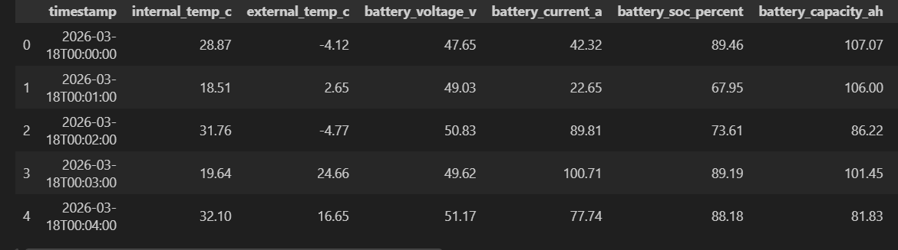
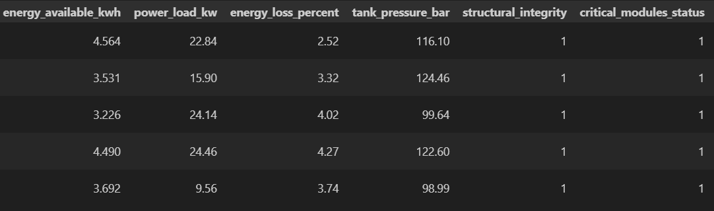
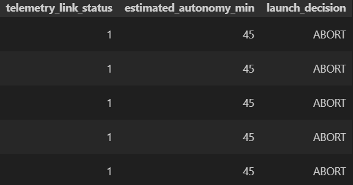
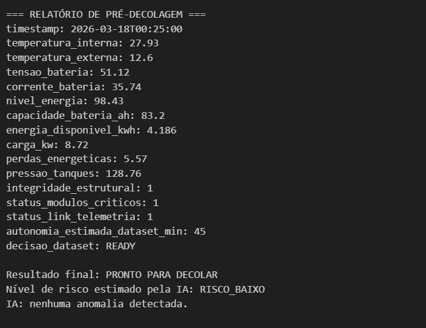
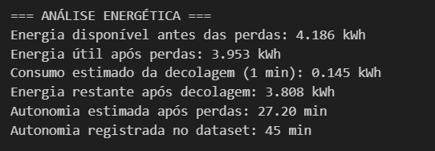

# AuroraSiger - Relatório de Pré-Decolagem com Apoio de IA

## Explicação do projeto

Este projeto foi desenvolvido para simular a análise de pré-decolagem de uma nave a partir de dados de telemetria. O sistema utiliza regras fixas de segurança para decidir entre **PRONTO PARA DECOLAR** e **DECOLAGEM ABORTADA**, com base em parâmetros como temperatura, energia, pressão dos tanques, integridade estrutural e status de sistemas críticos.

Além da verificação principal, o projeto também incorpora uma camada de **Inteligência Artificial** como apoio analítico. Essa IA não toma a decisão final da operação, mas auxilia na:

- estimativa do nível de risco;
- detecção de possíveis anomalias nos dados;
- análise complementar da situação operacional.

O projeto também realiza uma **análise energética**, calculando energia disponível, perdas, consumo estimado na decolagem e autonomia restante.

A versão final foi adaptada para utilizar um **dataset sintético** em formato CSV, chamado `telemetria_sintetica.csv`, tornando a simulação mais próxima de um cenário real de dados.

## Tecnologias utilizadas

- Python
- Pandas
- Scikit-learn
- Notebook Python

## Estrutura do projeto

- `aurorasiger_predeco.ipynb` → notebook principal do projeto
- `aurorasiger_predeco.py` → versão em script Python
- `telemetria_sintetica.csv` → dataset sintético utilizado na análise, feito com IA
- `README.md` → documentação do projeto

## Prints da execução

### Prévia do dataset sintético

### Relatório de pré-decolagem

### Análise energética

## Instruções de execução do código

### 1. Baixar o projeto

Certifique-se de que os arquivos abaixo estejam na mesma pasta:

- `aurorasiger_predeco.ipynb`
- `aurorasiger_predeco.py`
- `telemetria_sintetica.csv`

### 2. Criar e ativar o ambiente virtual

No terminal, dentro da pasta do projeto, execute:
**python -m venv .venv**

### 3. Ativar o ambiente virtual

Para ativar, execute:

**.\.venv\Scripts\Activate.ps1**

Se a ativação funcionar, o terminal deverá mostrar algo como:

**(.venv) PS C:\caminho\do\projeto>**

### 4. Instalar as dependências

Com o ambiente virtual ativado, execute:

**python -m pip install pandas scikit-learn jupyter**

### 5-1. Executar o script Python

Para rodar a versão em script, utilize:

**python aurorasiger_predeco.py**
  

### 5-2. Executar o notebook Python

Abra o arquivo `aurorasiger_predeco.ipynb` no VS Code ou em outro ambiente compatível com Jupyter Notebook e execute as células em ordem.

## Lógica geral do programa

Concluindo, o funcionamento do projeto segue essas etapas:

- leitura do dataset sintético de telemetria;
- seleção de uma amostra para simular a leitura atual dos sensores;
- verificação por regras fixas de segurança;
- apoio da IA para estimativa de risco;
- detecção de anomalias com modelo específico;
- geração do relatório de pré-decolagem;
- cálculo da análise energética;
- geração do relatório de energia.

### Projeto desenvolvido em grupo para fins acadêmicos (FIAP), com foco em análise de telemetria, tomada de decisão por regras e apoio de Inteligência Artificial.
